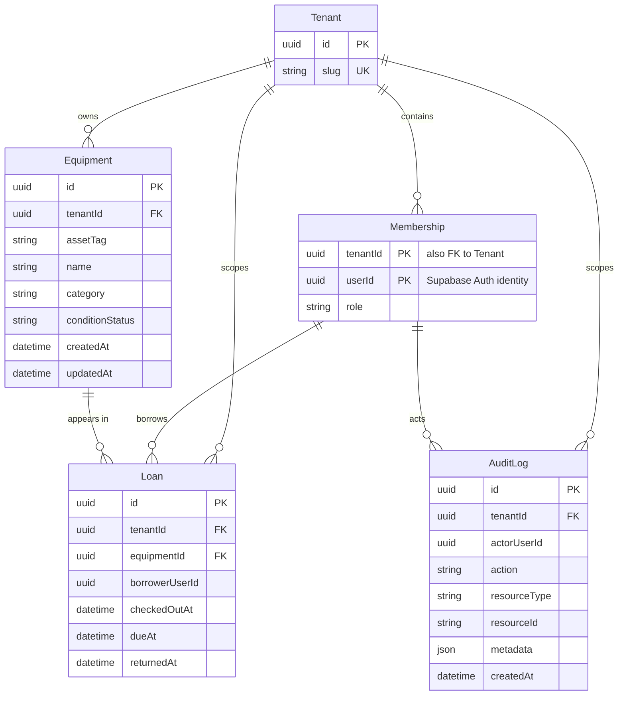

# Data Architecture & Persistence Layer

O modelo implementado contém cinco entidades de domínio para PostgreSQL: tenants, memberships, equipamentos, empréstimos e auditoria. O schema Prisma, a migration inicial e o seed local seguem o PRD e o ADR-001, que escolhe PostgreSQL/Supabase com Prisma Migrate. A migration ainda não foi aplicada a um banco.

## Database Configuration

| Service/Module | DB Type | Profile | Driver | Connection | Migration Tool |
|---|---|---|---|---|---|
| EmpresTI | PostgreSQL | Local/dev e produção futura no Supabase | Prisma Client | Runtime via Supavisor; migrations via conexão direta. Valores vêm de ambiente e não são incluídos aqui. | Prisma Migrate (schema e migration inicial criados; não aplicados) |

Não há configuração executável de banco, dependências, migrations ou seed no repositório neste momento.

## Data Ownership per Service

| Service | Tables Owned | ORM Framework | Caching | Notes |
|---|---|---|---|---|
| EmpresTI (monólito) | Tenant, Membership, Equipment, Loan, AuditLog | Prisma; schema e migration inicial implementados | Nenhuma configurada | Isolamento lógico por `tenant_id`; identidade do usuário é gerida pelo Supabase Auth |

## Entity Model

Modelo persistido em `prisma/schema.prisma` e `prisma/migrations/20261002110000_initial_schema/migration.sql`. `Equipment.conditionStatus` guarda a condição do item; disponibilidade emprestada é derivada da existência de Loan sem `returnedAt`. O usuário é uma identidade externa do Supabase Auth e não uma tabela de credenciais do EmpresTI.

<!-- mermaid-checked: every attribute is `<type> <name> [<key>] ["<description>"]` with at most one of PK/FK/UK, no \n in descriptions, no {} in descriptions, every relationship label is double-quoted -->

Proposed integrity rules:

- `Membership` has a composite primary key `(tenant_id, user_id)` and role `ADMIN` or `COLLABORATOR`. `user_id` is an external Supabase Auth UUID; the application schema does not own passwords or auth accounts.
- `Equipment` has a unique `(tenant_id, asset_tag)`. Its condition is `AVAILABLE` or `MAINTENANCE`; `ON_LOAN` is not stored as a second source of truth.
- `Loan` retains returned records. `returned_at IS NULL` identifies an open loan. Composite foreign keys `(tenant_id, equipment_id)` and `(tenant_id, borrower_user_id)` prevent cross-tenant associations.
- A partial unique index on `(tenant_id, equipment_id) WHERE returned_at IS NULL` prevents concurrent open loans for one equipment unit.
- The service must serialize competing checkout requests per membership and count open loans in the transaction to enforce the three-item limit and overdue block. These are aggregate rules and cannot be expressed as an ordinary row `CHECK`.
- The service calculates `due_at` as 14 days after `checked_out_at`; overdue is derived from `due_at < current time` while `returned_at IS NULL`.
- All tenant-owned tables have forced RLS policies. Runtime access requires a role without `BYPASSRLS`, transaction-local tenant/user context, and explicit schema/table privileges (including `USAGE`/`EXECUTE` for `app.is_tenant_admin`); these deployment-specific grants are not created because the runtime role name is not defined. This differs from the owner-role connection described in ADR-001 and must be reconciled before configuring runtime credentials. The migration has not been applied.
- `AuditLog` is append-only; the migration installs a trigger that rejects updates and deletes. Local seed execution requires a local database role capable of bypassing forced RLS; the seed script checks this before writing.
- Invitations remain in Supabase Auth; first login creates the default-tenant `COLLABORATOR` membership. The first `ADMIN` is provisioned by the local seed; later role changes use a server-side administrative operation. No invitation entity is needed.
- `RETIRED`/out-of-service equipment is omitted because the PRD does not define that state for v1.

## Key Repository Methods

| Service | Repository | Notable Methods | Purpose |
|---|---|---|---|
| EmpresTI | Not implemented | None found | The schema and migration exist, but application services and repository interfaces are not implemented yet. |

Expected query responsibilities, not implemented APIs: tenant-scoped equipment catalog; open loans by borrower; open loans for Operations; count of a member's open loans; overdue-loan existence; and audit writes.

## Caching Strategy

No database or application caching layer is configured. No cache is proposed for availability or open-loan counts because those values participate in checkout eligibility and must reflect transactional state.

## Data Ownership Boundaries

The planned topology is one shared PostgreSQL database with logical tenant isolation by `tenant_id`, not a database per tenant. Prisma Migrate is the sole schema path for domain data; Supabase Auth owns authentication identities and invitation delivery. The user identifier stored by the domain is an external Auth UUID. No cross-service repository methods or cache-backed aggregation exist in the current repository.

### Data Classification & Sensitivity

| Entity | Sensitive Fields | Classification (PII/PHI/PCI/None) | Controls in Place |
|---|---|---|---|
| Membership | `user_id` links to an identity; role and tenant association | PII linkage | Proposed tenant-scoped composite key and authorization through membership; encryption/masking are not configured in repository files |
| Loan | `borrower_user_id`, checkout and return dates | PII linkage | Proposed tenant-scoped relationship and server-side tenant filtering; encryption/masking are not configured in repository files |
| AuditLog | `actor_user_id`, action and resource identifiers | PII linkage | Append-only intent in ADR-001; enforcement and masking are not implemented |
| Supabase Auth identity | Email and authentication data, managed outside the application schema | PII | Supabase Auth is selected, but encryption, retention and masking settings cannot be verified from this repository |
| Equipment | Asset tag, category, condition | None identified | No special controls implemented; tenant scoping is part of the proposed model |

No PHI or PCI fields are indicated by the PRD. The application repository does not establish encryption-at-rest, field-level masking, retention, or deletion controls; these need verification/configuration before production use.
